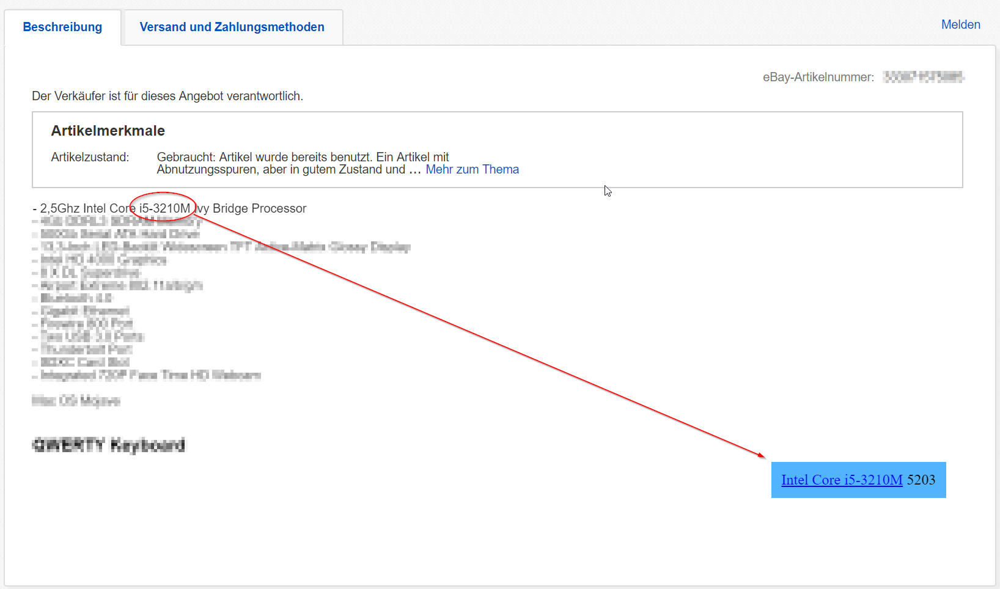

# Chrome Ebay CPU Info

This Chrome extension will show you the
[Geekbench Score](https://browser.geekbench.com/processor-benchmarks) of any
article you find on Ebay which contains a CPU.

For example: 
 

Tested with Intel processors, AMD may not work.
